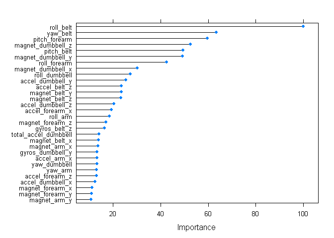
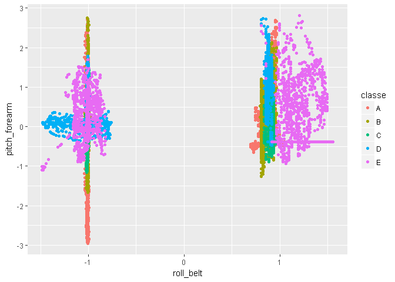
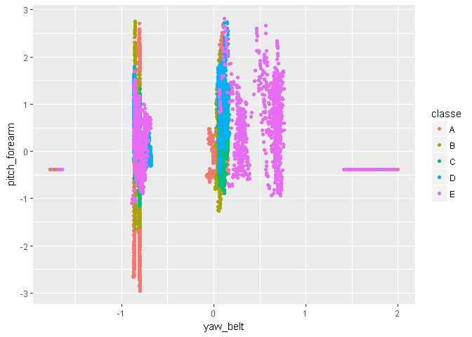

# Practical Machine Learning Course Project
Saturday, January 14, 2017  


## Background
Using devices such as Jawbone Up, Nike FuelBand, and Fitbit it is now possible to collect a large amount of data about personal activity relatively inexpensively. These type of devices are part of the quantified self movement - a group of enthusiasts who take measurements about themselves regularly to improve their health, to find patterns in their behavior, or because they are tech geeks. One thing that people regularly do is quantify how much of a particular activity they do, but they rarely quantify how well they do it. This project uses data from accelerometers on the belt, forearm, arm, and dumbell of 6 participants. They were asked to perform barbell lifts correctly and incorrectly in 5 different ways. More information is available from the website here: http://groupware.les.inf.puc-rio.br/har (see the section on the Weight Lifting Exercise Dataset). The goal of the project is to predict the manner in which they did the exercise (the "classe" variable in the training set).

## Load Libraries

```r
library(caret)
library(randomForest)
library(ggplot2)
```

## Load Raw Training and Test Data

```r
training.file <- "pml-training.csv"
testing.file  <- "pml-testing.csv"

# Check if the data files exist locally, if not retrieve
if ( !file.exists(training.file) ) {
  download.file("https://d396qusza40orc.cloudfront.net/predmachlearn/pml-training.csv", destfile=training.file)  
}
if ( !file.exists(testing.file) ) {
  download.file("https://d396qusza40orc.cloudfront.net/predmachlearn/pml-testing.csv", destfile=testing.file)  
}

# Load data with minimal cleanup
training.raw <- read.csv(training.file, na.strings = c("NA", "#DIV/0!", ""))
testing.raw  <- read.csv(testing.file,  na.strings = c("NA", "#DIV/0!", ""))
```

## Cleaning the Data

```r
dim(training.raw)       # Size of training data
```

```
## [1] 19622   160
```

```r
dim(testing.raw)        # Size of testing data
```

```
## [1]  20 160
```

Check for variables with more than 50% NAs:

```r
NA_vars <- sapply(training.raw, function(x) {sum(is.na(x))}) >  0.5*dim(training.raw)[1]
```

The initial training data set is of size 19622 observations by 160 variables. However there are 100 variables with 50% or more of the observations missing. Interpolating such a large number of missing observations by imputing values seems unsatisfactory. Therefore we will exclude these variables:

```r
training.clean <- training.raw[,!NA_vars]
dim(training.clean)                      # Size of partly cleaned non-NA training data
```

```
## [1] 19622    60
```

Next, check for and remove any variables which have zero or near zero variance predictors:

```r
NZP <- nearZeroVar(training.clean,saveMetrics=TRUE)
training.clean <- training.clean[,!NZP$nzv]
dim(training.clean)                     # Size of partly cleaned training data having removed NZ predictors
```

```
## [1] 19622    59
```
This removes one more variable.

Examine the surviving variables:

```r
str(training.clean)
```

```
## 'data.frame':	19622 obs. of  59 variables:
##  $ X                   : int  1 2 3 4 5 6 7 8 9 10 ...
##  $ user_name           : Factor w/ 6 levels "adelmo","carlitos",..: 2 2 2 2 2 2 2 2 2 2 ...
##  $ raw_timestamp_part_1: int  1323084231 1323084231 1323084231 1323084232 1323084232 1323084232 1323084232 1323084232 1323084232 1323084232 ...
##  $ raw_timestamp_part_2: int  788290 808298 820366 120339 196328 304277 368296 440390 484323 484434 ...
##  $ cvtd_timestamp      : Factor w/ 20 levels "02/12/2011 13:32",..: 9 9 9 9 9 9 9 9 9 9 ...
##  $ num_window          : int  11 11 11 12 12 12 12 12 12 12 ...
##  $ roll_belt           : num  1.41 1.41 1.42 1.48 1.48 1.45 1.42 1.42 1.43 1.45 ...
##  $ pitch_belt          : num  8.07 8.07 8.07 8.05 8.07 8.06 8.09 8.13 8.16 8.17 ...
##  $ yaw_belt            : num  -94.4 -94.4 -94.4 -94.4 -94.4 -94.4 -94.4 -94.4 -94.4 -94.4 ...
##  $ total_accel_belt    : int  3 3 3 3 3 3 3 3 3 3 ...
##  $ gyros_belt_x        : num  0 0.02 0 0.02 0.02 0.02 0.02 0.02 0.02 0.03 ...
##  $ gyros_belt_y        : num  0 0 0 0 0.02 0 0 0 0 0 ...
##  $ gyros_belt_z        : num  -0.02 -0.02 -0.02 -0.03 -0.02 -0.02 -0.02 -0.02 -0.02 0 ...
##  $ accel_belt_x        : int  -21 -22 -20 -22 -21 -21 -22 -22 -20 -21 ...
##  $ accel_belt_y        : int  4 4 5 3 2 4 3 4 2 4 ...
##  $ accel_belt_z        : int  22 22 23 21 24 21 21 21 24 22 ...
##  $ magnet_belt_x       : int  -3 -7 -2 -6 -6 0 -4 -2 1 -3 ...
##  $ magnet_belt_y       : int  599 608 600 604 600 603 599 603 602 609 ...
##  $ magnet_belt_z       : int  -313 -311 -305 -310 -302 -312 -311 -313 -312 -308 ...
##  $ roll_arm            : num  -128 -128 -128 -128 -128 -128 -128 -128 -128 -128 ...
##  $ pitch_arm           : num  22.5 22.5 22.5 22.1 22.1 22 21.9 21.8 21.7 21.6 ...
##  $ yaw_arm             : num  -161 -161 -161 -161 -161 -161 -161 -161 -161 -161 ...
##  $ total_accel_arm     : int  34 34 34 34 34 34 34 34 34 34 ...
##  $ gyros_arm_x         : num  0 0.02 0.02 0.02 0 0.02 0 0.02 0.02 0.02 ...
##  $ gyros_arm_y         : num  0 -0.02 -0.02 -0.03 -0.03 -0.03 -0.03 -0.02 -0.03 -0.03 ...
##  $ gyros_arm_z         : num  -0.02 -0.02 -0.02 0.02 0 0 0 0 -0.02 -0.02 ...
##  $ accel_arm_x         : int  -288 -290 -289 -289 -289 -289 -289 -289 -288 -288 ...
##  $ accel_arm_y         : int  109 110 110 111 111 111 111 111 109 110 ...
##  $ accel_arm_z         : int  -123 -125 -126 -123 -123 -122 -125 -124 -122 -124 ...
##  $ magnet_arm_x        : int  -368 -369 -368 -372 -374 -369 -373 -372 -369 -376 ...
##  $ magnet_arm_y        : int  337 337 344 344 337 342 336 338 341 334 ...
##  $ magnet_arm_z        : int  516 513 513 512 506 513 509 510 518 516 ...
##  $ roll_dumbbell       : num  13.1 13.1 12.9 13.4 13.4 ...
##  $ pitch_dumbbell      : num  -70.5 -70.6 -70.3 -70.4 -70.4 ...
##  $ yaw_dumbbell        : num  -84.9 -84.7 -85.1 -84.9 -84.9 ...
##  $ total_accel_dumbbell: int  37 37 37 37 37 37 37 37 37 37 ...
##  $ gyros_dumbbell_x    : num  0 0 0 0 0 0 0 0 0 0 ...
##  $ gyros_dumbbell_y    : num  -0.02 -0.02 -0.02 -0.02 -0.02 -0.02 -0.02 -0.02 -0.02 -0.02 ...
##  $ gyros_dumbbell_z    : num  0 0 0 -0.02 0 0 0 0 0 0 ...
##  $ accel_dumbbell_x    : int  -234 -233 -232 -232 -233 -234 -232 -234 -232 -235 ...
##  $ accel_dumbbell_y    : int  47 47 46 48 48 48 47 46 47 48 ...
##  $ accel_dumbbell_z    : int  -271 -269 -270 -269 -270 -269 -270 -272 -269 -270 ...
##  $ magnet_dumbbell_x   : int  -559 -555 -561 -552 -554 -558 -551 -555 -549 -558 ...
##  $ magnet_dumbbell_y   : int  293 296 298 303 292 294 295 300 292 291 ...
##  $ magnet_dumbbell_z   : num  -65 -64 -63 -60 -68 -66 -70 -74 -65 -69 ...
##  $ roll_forearm        : num  28.4 28.3 28.3 28.1 28 27.9 27.9 27.8 27.7 27.7 ...
##  $ pitch_forearm       : num  -63.9 -63.9 -63.9 -63.9 -63.9 -63.9 -63.9 -63.8 -63.8 -63.8 ...
##  $ yaw_forearm         : num  -153 -153 -152 -152 -152 -152 -152 -152 -152 -152 ...
##  $ total_accel_forearm : int  36 36 36 36 36 36 36 36 36 36 ...
##  $ gyros_forearm_x     : num  0.03 0.02 0.03 0.02 0.02 0.02 0.02 0.02 0.03 0.02 ...
##  $ gyros_forearm_y     : num  0 0 -0.02 -0.02 0 -0.02 0 -0.02 0 0 ...
##  $ gyros_forearm_z     : num  -0.02 -0.02 0 0 -0.02 -0.03 -0.02 0 -0.02 -0.02 ...
##  $ accel_forearm_x     : int  192 192 196 189 189 193 195 193 193 190 ...
##  $ accel_forearm_y     : int  203 203 204 206 206 203 205 205 204 205 ...
##  $ accel_forearm_z     : int  -215 -216 -213 -214 -214 -215 -215 -213 -214 -215 ...
##  $ magnet_forearm_x    : int  -17 -18 -18 -16 -17 -9 -18 -9 -16 -22 ...
##  $ magnet_forearm_y    : num  654 661 658 658 655 660 659 660 653 656 ...
##  $ magnet_forearm_z    : num  476 473 469 469 473 478 470 474 476 473 ...
##  $ classe              : Factor w/ 5 levels "A","B","C","D",..: 1 1 1 1 1 1 1 1 1 1 ...
```

Sanity check to see if any NAs left in the data set:

```r
anyNA(training.clean)                  # No NAs left in training data set
```

```
## [1] FALSE
```

The first variable "X" appears to be an index of the observations. The variable "user_name" is the id of the participant. The variables "raw_timestamp_part_1", "raw_timestamp_part_2" and "cvtd_timestamp" all seem to be date/time stamps. The variable "num_window" appears to be another index variable, perhaps for the group of observations within a particular time window for each participant. As these variables seem to be secondary to the recorded variables of interest they will therefore be removed from the subsequent analysis.

```r
training.clean <- training.clean[,-c(1:6)]
dim(training.clean)                    # Final Size of cleaned training data
```

```
## [1] 19622    53
```

Preprocess the data to center and scale it:

```r
preObj <- preProcess(training.clean[,-53], method=c("center","scale"))
training.clean.pp <- data.frame(cbind(classe=training.clean[,53],predict(preObj, training.clean[,-53])))
```

Apply same series of cleanup steps to the testing data:

```r
testing.clean <- testing.raw[,!NA_vars]
testing.clean <- testing.clean[,!NZP$nzv]
testing.clean <- testing.clean[,-c(1:6)]
testing.clean.pp <- data.frame(cbind(classe=testing.clean[,53],predict(preObj, testing.clean[,-53])))
dim(testing.clean.pp)                 # Final Size of cleaned testing data (same number of vars as training.clean)
```

```
## [1] 20 53
```

## Split the data
Having cleaned the data, now split it into a subset for training (70% of cases) and an independent subset for data validation (remaining 30% of cases):

```r
set.seed(8421)                         # Set seed to a particular value to ensure reproducibility
inTrain   <- createDataPartition(training.clean.pp$classe, p=0.70, list=F)
train <- training.clean.pp[inTrain, ]
valid <- training.clean.pp[-inTrain, ]
```

## Model Building
LDA, Random Forest and GBM models were all run and tested. LDA and GBM models were significantly lesss accurate than the Random Forest model. Therefore the Random Forest model was the preferred modelling choice. For brevity, only the final Random Forest analysis is shown here. A Random Forest model was run on the cleaned up training data. 10-fold cross validation was used to create an in-sample error estimate of the error.

## Fit Random Forest model with 10-fold cross validation

```r
fitCtrl <- trainControl(method = "cv", number=10)
# Select a range of mtry parameters to try to fit over
grid <- expand.grid(mtry=c(5,7,10,12,15,20,25,30))
grid
```

```
##   mtry
## 1    5
## 2    7
## 3   10
## 4   12
## 5   15
## 6   20
## 7   25
## 8   30
```

```r
# This model fit takes a long time to run with default ntree=500. 
# Check if the model has already been saved and if so load it, otherwise calculate afresh
if (file.exists("rf_model.rda")) {
  load("rf_model.rda")
} else {
 rf_model <- train(classe ~ ., data = train, method = "rf", trControl = fitCtrl, tuneGrid=grid)
 save(rf_model, file="rf_model.rda")
}

# OOB Error (as a percentage)
OOB_error <- round(100*(1-sum(diag(rf_model$finalModel$confusion))/dim(train)[1]),2)
OOB_error
```

```
## [1] 0.53
```

## Fitted model

```r
# Characteristics of fitted model
rf_model
```

```
## Random Forest 
## 
## 13737 samples
##    52 predictor
##     5 classes: 'A', 'B', 'C', 'D', 'E' 
## 
## No pre-processing
## Resampling: Cross-Validated (10 fold) 
## Summary of sample sizes: 12363, 12364, 12362, 12362, 12363, 12364, ... 
## Resampling results across tuning parameters:
## 
##   mtry  Accuracy   Kappa    
##    5    0.9935212  0.9918049
##    7    0.9939579  0.9923573
##   10    0.9941763  0.9926338
##   12    0.9938123  0.9921735
##   15    0.9939580  0.9923576
##   20    0.9933755  0.9916208
##   25    0.9921380  0.9900550
##   30    0.9912645  0.9889501
## 
## Accuracy was used to select the optimal model using  the largest value.
## The final value used for the model was mtry = 10.
```

```r
rf_model$finalModel
```

```
## 
## Call:
##  randomForest(x = x, y = y, mtry = param$mtry) 
##                Type of random forest: classification
##                      Number of trees: 500
## No. of variables tried at each split: 10
## 
##         OOB estimate of  error rate: 0.53%
## Confusion matrix:
##      A    B    C    D    E class.error
## A 3902    3    0    0    1 0.001024066
## B    8 2641    9    0    0 0.006395786
## C    0    9 2384    3    0 0.005008347
## D    0    0   26 2223    3 0.012877442
## E    0    0    2    9 2514 0.004356436
```

```r
# Show the relative importance of top 30 variables
plot(varImp(rf_model),30)
```

<!-- -->

```r
# Show the relationship between the top 3 variables
# There is some separability between the classes but also some overlap
qplot(roll_belt, yaw_belt, color=classe, data=train)
```

<!-- -->

```r
qplot(roll_belt, pitch_forearm, color=classe, data=train)
```

<!-- -->

```r
qplot(yaw_belt, pitch_forearm, color=classe, data=train)
```

<!-- -->

## Out-of-sample error

```r
# Use the independent validation data to test the out of sample error via the prediction accuracy 
valid_pred <- predict(rf_model, valid)
confusionMatrix(valid_pred, valid$classe)
```

```
## Confusion Matrix and Statistics
## 
##           Reference
## Prediction    A    B    C    D    E
##          A 1673    3    0    0    0
##          B    1 1131    3    0    0
##          C    0    5 1022    7    4
##          D    0    0    1  957    1
##          E    0    0    0    0 1077
## 
## Overall Statistics
##                                           
##                Accuracy : 0.9958          
##                  95% CI : (0.9937, 0.9972)
##     No Information Rate : 0.2845          
##     P-Value [Acc > NIR] : < 2.2e-16       
##                                           
##                   Kappa : 0.9946          
##  Mcnemar's Test P-Value : NA              
## 
## Statistics by Class:
## 
##                      Class: A Class: B Class: C Class: D Class: E
## Sensitivity            0.9994   0.9930   0.9961   0.9927   0.9954
## Specificity            0.9993   0.9992   0.9967   0.9996   1.0000
## Pos Pred Value         0.9982   0.9965   0.9846   0.9979   1.0000
## Neg Pred Value         0.9998   0.9983   0.9992   0.9986   0.9990
## Prevalence             0.2845   0.1935   0.1743   0.1638   0.1839
## Detection Rate         0.2843   0.1922   0.1737   0.1626   0.1830
## Detection Prevalence   0.2848   0.1929   0.1764   0.1630   0.1830
## Balanced Accuracy      0.9993   0.9961   0.9964   0.9962   0.9977
```

```r
# Out-of-sample error rate (as a percentage)
OOS_error <- round(100*(1-mean(valid_pred == valid$classe)),2)
OOS_error
```

```
## [1] 0.42
```

## Conclusion
From the bivariate plots separation of classes might be expected to be quite difficult. However it can be seen that the Random Forest model provides a very high degree of classification accuracy. The out-of-bag (OOB) error estimated via the 10-fold cross validation within the training sample was 0.53%. The unbiased out-of-sample error rate estimated from the independent sample is consistent with this and was actually slightly smaller at 0.42%. 

## Predictions on the hold-out Testing data set

```r
pred_test <- predict(rf_model, testing.clean.pp)
pred_test
```

```
##  [1] B A B A A E D B A A B C B A E E A B B B
## Levels: A B C D E
```
